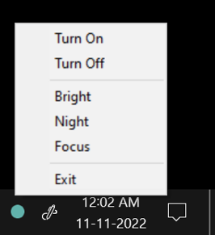

# WizLightTray

I have a Philips Wiz Light, the mobile app works well, but I like to control it from the PC and there are no good light-weight and snappy apps (read: low resource and startup time) that just work. Having tried a few options ranging from  Py/Cpp CLIs to Bluestack VM that runs the full android wiz app (all of them do work) I strongly beleive this is the way to go!

It's a system tray icon that starts automatically and control the light in 2 clicks.

----

### Build
go build -ldflags "-H=windowsgui"

### To add to startup
https://support.microsoft.com/en-us/topic/150da165-dcd9-7230-517b-cf3c295d89dd

